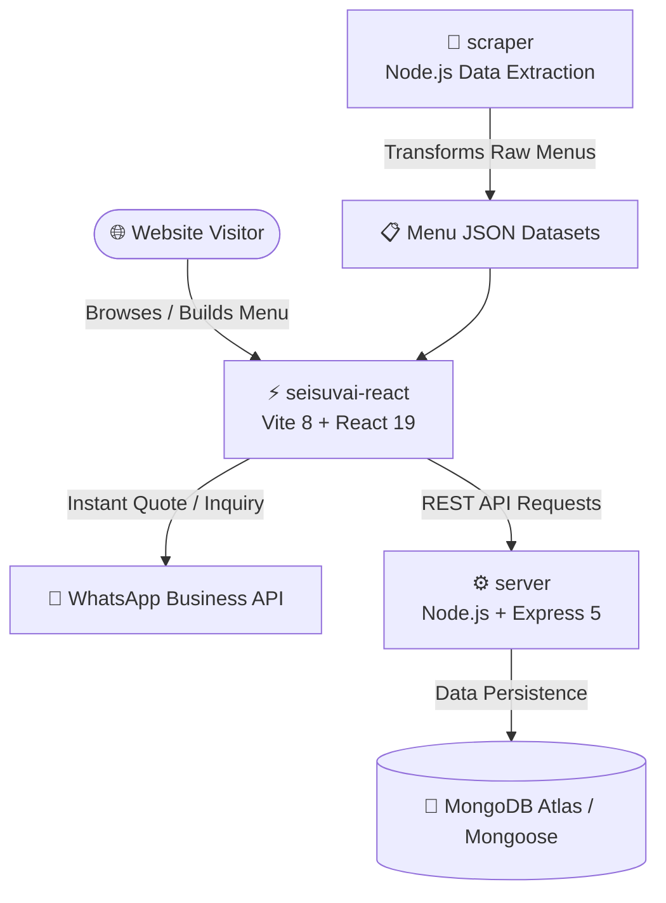

# 👑 Seisuvai Catering — Premium Digital Culinary Platform

<div align="center">


</div>

---

## 📌 Executive Overview

**Seisuvai Catering** (சேவை & சுவை — *Service & Taste*) is an ultra-premium, full-stack digital catering experience designed for grand wedding feasts, traditional South Indian banana leaf banquets, corporate galas, and intimate celebrations.

Engineered with a **mobile-first responsive architecture**, dynamic **3D interactive hero element (Three.js WebGL)**, custom **Menu Builder Engine**, interactive **Live Food Stall Selector**, and seamless **WhatsApp Quote Integration**, Seisuvai combines traditional hospitality with cutting-edge web technology.

---

## 🏛️ System Architecture

The repository is structured into three clean, decoupled domains following the **BMAD Architecture Spine**:



---

## ✨ Key Platform Features

### 🍲 1. Curated Standard Menus
- **Multi-Category Spread**: Breakfast, Lunch, Dinner, Baby Shower, Marriage, and Housewarming packages.
- **Tiered Packages**: Economy Selection, Premium Feast, and Executive Royal Banquet options.
- **Detailed Modal Inspection**: Full itemized popup cards with dietary indicators.

### 🎨 2. Interactive Custom Menu Builder (`CustomMenu.jsx`)
- **Dietary Toggle**: Instant tab filtering for 🌿 **Vegetarian** and 🍖 **Non-Vegetarian** items (mobile & desktop optimized).
- **Categorized Selection**: Welcome Drinks, Soups, Starters, Rice & Biryanis, Gravies & Curries, Poriyal & Kootu, Sweets & Desserts, Payasam, and Extras.
- **Real-Time Tray Counter**: Floating item counter tracking selected delicacies.

### 🔥 3. Interactive Live Counters (`LiveCounters.jsx`)
- **Interactive Stalls**: Pani Puri, Dosa Station, Chocolate Fountain, Chat Stall, Popcorn, Ice Cream, and mocktail stations.
- **Add-to-Quote**: One-click addition to the inquiry payload.

### 🪔 4. 3D Traditional Handi & Steaming Cauldron (`HeroScene3D.jsx`)
- **Interactive Three.js WebGL Model**: Brass cooking handi with animated rising steam, floating spices (star anise, cardamom), and glowing embers.
- **Mobile Optimization**: Automatically falls back to lightweight CSS animation (`HeroMobileVisual.jsx`) on viewports `<1024px` to ensure 0 WebGL overhead on phones.

### 💬 5. Direct WhatsApp & Dual API Booking Pipeline (`whatsapp.js` + Express)
- Generates structured, beautifully formatted WhatsApp text quotes sent straight to catering directors.
- Dual submission resilience: Backend API stores inquiries in MongoDB while immediately opening direct WhatsApp chat.

---

## 📁 Repository Structure

```
c:\Projects\Personal projects\Seisuvai Catering Website\
├── 📄 README.md                        # Master Project Documentation
├── 📄 project-context.md               # AI Agent & Developer Architecture Rules
├── 📄 .env                             # Environment Variables
├── 📄 .gitignore                       # Git Exclusion Rules
│
├── 📁 seisuvai-react/                  # Frontend (React 19 + Vite 8)
│   ├── 📁 public/                      # Static Assets (Images, Favicons)
│   ├── 📁 src/
│   │   ├── 📁 components/              # UI Components (Navbar, Footer, Modals)
│   │   │   ├── 📁 hero/                # 3D Canvas & Mobile Hero Visuals
│   │   │   └── 📁 menu/                # Standard, Custom Menu & Live Counter Builders
│   │   ├── 📁 data/                    # Menu Datasets (siteData, customMenuData, etc.)
│   │   ├── 📁 pages/                   # Page Views (HomePage)
│   │   ├── 📁 sections/                # Page Sections (Hero, About, Menus, Testimonials)
│   │   ├── 📁 store/                   # Zustand Global State (useStore.js)
│   │   └── 📁 utils/                   # WhatsApp & REST API Helpers
│   ├── 📄 package.json                 # Dependencies & Vitest Scripts
│   ├── 📄 vite.config.js               # Vite + Tailwind Setup
│   └── 📄 README.md                    # Frontend Documentation
│
├── 📁 server/                          # Backend API (Node.js + Express 5)
│   ├── 📁 config/                      # MongoDB Connection Config
│   ├── 📁 models/                      # Mongoose Data Schemas (Booking, Enquiry, Review)
│   ├── 📁 routes/                      # API Endpoint Handlers
│   ├── 📄 index.js                     # Express Entry Point & Middleware
│   ├── 📄 package.json                 # Backend Scripts
│   └── 📄 README.md                    # Backend Documentation
│
└── 📁 scraper/                         # Menu Data Classifier & Parsing Tool
    ├── 📁 output/                      # Extracted Datasets (JSON, CSV, SQL)
    ├── 📄 index.js                     # Scraper Orchestrator
    ├── 📄 menuClassifier.js            # Categorization Rules Engine
    ├── 📄 raw_menu.txt                 # Source Menu Text Data
    └── 📄 README.md                    # Scraper Documentation
```

---

## ⚙️ Environment Setup

Create a `.env` file in the project root:

```env
# Server & API Configuration
PORT=5000
MONGODB_URI=mongodb://localhost:27017/seisuvai_catering
FRONTEND_URL=http://localhost:5173
ALLOWED_ORIGINS=http://localhost:5000,http://localhost:5173

# Business Operations
ADMIN_PASSCODE=seisuvai
WHATSAPP_NUMBER=919788313225
```

---

## 🚀 Quick Start Guide

### 1. Install Dependencies
```bash
# Frontend
cd seisuvai-react
npm install

# Backend
cd ../server
npm install

# Scraper (optional)
cd ../scraper
npm install
```

### 2. Run Development Servers
```bash
# Terminal 1: Run React Frontend (http://localhost:5173)
cd seisuvai-react
npm run dev

# Terminal 2: Run Express Backend (http://localhost:5000)
cd server
npm run dev
```

---

## 🧪 Testing & Verification

The frontend includes a **Vitest unit test suite** covering state logic, dataset integrity, and interactive UI components.

```bash
cd seisuvai-react

# Run all unit tests
npx vitest run

# Run tests in watch mode
npm run test

# Verify production build compilation
npm run build
```

---

## 📜 Development Conventions (BMAD Method)

This project follows the **BMAD Method** for structured AI pair programming:
- **No Pricing Leaks**: Pricing is excluded from static menu cards; all custom requests trigger tailored quotes.
- **Mobile First**: All touch targets meet 44×44px minimum bounds.
- **Accessibility & Performance**: `prefers-reduced-motion` compliance on 3D animations; zero CLS layout containers.

---

<div align="center">
  <sub>Crafted with ❤️ for Seisuvai Catering • Black & Gold Premium Design System</sub>
</div>
